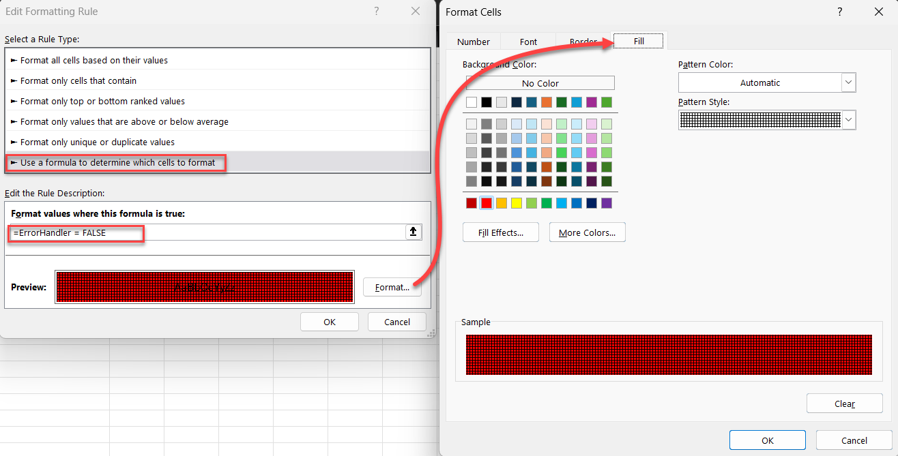

# Excel Dependent Dropdown Guide

## Creating Connected Data Validation Lists Without VBA Macros


This guide will walk you through creating a two-level dependent dropdown system in Excel where:

1. The first dropdown lets users select a company
2. The second dropdown automatically filters to show only products from that company
3. Visual warnings appear if an incompatible product is selected

This template is perfect for creating order forms, data entry sheets, or any situation where you need to ensure users select valid combinations of related items.

## Step-by-Step Instructions

> [!TIP] 
> Using table names and Named Ranges will avoid a lot of issues that  can come up when adding, editing, or referencing this data in other  places.

### Step 1: Set Up Your Data Table

1. Create a new Excel workbook
2. Rename the first sheet to "ClientSide" (this will be your user interface)
3. Create a second sheet named "BackEnd" (this will store your data and helper functions)
4. On the BackEnd sheet, create a simple two-column table:
   - Column A: "Company" (header in cell A2)
   - Column B: "Product" (header in cell B2)
   - Enter your company-product combinations below these headers

5. Format this as a proper Excel Table:
   - Select your data including headers
   - Press Ctrl+T or go to Insert → Table
   - Ensure "My table has headers" is checked
   - Name your table "myData" (click on the "Table Design" tab, then enter "myData" in the Table Name field)
### Step 2: Create the Filter Function

1. On the BackEnd sheet, enter a descriptive header in cell D1 (e.g., "Dynamic Range based on filter function")
2. In cell D1, enter this formula:
   ```cs
   =FILTER(myData[Product],myData[Company]=ClientSide!D3,"")
   ```
   This formula:
   - Looks at the Product column in your table
   - Shows only products from the company selected on the ClientSide sheet
   - Returns blank ("") if no matches are found

3. Create a Named Range for this filtered result:
   - Go to Formulas → Name Manager → New
   - Name: FilteredProducts
   - Refers to: "=BackEnd!$D$1#"
   - Click OK


### Step 3: Create a Helper Function for Error Checking

1. On the BackEnd sheet, enter a descriptive header in cell F1 (e.g., "Helper Function")
2. In cell F3, enter this formula:
   ```cs
   =COUNTIFS(myData[Company],ClientSide!D3,myData[Product],ClientSide!D5)>0
   ```
   This formula:
   - Counts how many times the selected company-product combination appears in your data
   - Returns TRUE if it's a valid combination, FALSE if not

3. Create a Named Range for this helper function:
   - Go to Formulas → Name Manager → New
   - Name: ErrorHandler
   - Refers to: "=BackEnd!$F$3"
   - Click OK


>[!TIP]
>The # at the end of BackEnd!$F$1# denotes that the cell contains a dynamic array and will link all of the data instead of only what is in cell F1
### Step 4: Set Up the User Interface

1. Go to the ClientSide sheet
2. In cell A2, enter "Select Company"
3. In cell A4, enter "Select Product"
4. Format these cells as desired to make them stand out as labels

### Step 5: Create the First Data Validation (Company Dropdown)

1. On the ClientSide sheet, select cell D3 (where users will select a company)
2. Go to Data → Data Validation
3. Under Settings:
   - Allow: List
   - Source: "=myData[Company]"
1. Under Input Message:
   - Show input message when cell is selected: Checked
   - Title: Warning
   - Input message: Changing company will require selecting a new product
1. Click OK
### Step 6: Create the Second Data Validation (Product Dropdown)

1. On the ClientSide sheet, select cell D5 (where users will select a product)
2. Go to Data → Data Validation
3. Under Settings:
   - Allow: List
   - Source: `=FilteredProducts`
4. Click OK
### Step 7: Add Conditional Formatting for Error Highlighting

1. On the ClientSide sheet, select cell D5 (the product selection cell)
2. Go to Home → Conditional Formatting → New Rule
3. Select "Use a formula to determine which cells to format"
4. Enter the formula: `=ErrorHandler=FALSE`
5. Click "Format" and set:
   - Fill tab: Choose a red background color



## How to Use the Template

1. On the ClientSide sheet, click the dropdown arrow in cell D3 to select a company
2. Notice the warning message about changing the company
3. Click the dropdown arrow in cell D5 to select a product
   - Only products for the selected company will appear
4. Try this test:
   - Select a company and valid product
   - Change the company without changing the product
   - The product cell should turn red, indicating an invalid combination

## How It Works

This template uses three key Excel features that work together:

1. **FILTER Function**: Creates a dynamic list of products based on the selected company
2. **Named Ranges**: Allow us to reference the filtered products and error checking formula easily
3. **Conditional Formatting**: Provides visual feedback when invalid combinations are selected

The beauty of this approach is that it requires no VBA macros, making it compatible with environments where macros are prohibited for security reasons.

## Troubleshooting

- **The product dropdown doesn't update**: Make sure your FILTER formula references the correct cells and that your named range is set up correctly
- **Error highlighting doesn't work**: Check that your conditional formatting formula references the correct named range
- **Company or product lists are incomplete**: Verify that your data table contains all combinations and is properly formatted as an Excel Table

## Customizing the Template

- Add more columns to your data table for additional properties
- Create more dependent dropdowns by duplicating the pattern
- Adjust the conditional formatting to use different colors or add icons
- Add more helper functions to validate other aspects of data entry

## Adapting the Template for Different Types of Data

This template can be easily adapted for various business scenarios. Here are some examples:

### 1. Customer-Order System
- **Data Table Structure**:
  - Column A: Customer Names
  - Column B: Previous Orders
  - Additional columns: Order details, prices, delivery dates

- **Implementation**:
  - First dropdown: Customer selection
  - Second dropdown: Only shows that customer's previous orders
  - Additional benefit: Add a SUMIFS formula to show total spent or order count

### 2. Location-Based Data
- **Data Table Structure**:
  - Column A: Countries
  - Column B: Cities
  - Additional columns: Population, local time zone, currency

- **Implementation**:
  - First dropdown: Country selection
  - Second dropdown: Only cities in that country
  - Enhance with: XLOOKUP to display the country's currency code automatically

### 3. Product Categories and Items
- **Data Table Structure**:
  - Column A: Category (Electronics, Clothing, Food)
  - Column B: Products
  - Column C: Prices
  - Column D: Inventory count

- **Implementation**:
  - First dropdown: Product category
  - Second dropdown: Products in that category
  - Use helper formulas to display price and check inventory status

### 4. Project Management
- **Data Table Structure**:
  - Column A: Project Names
  - Column B: Tasks
  - Column C: Assigned Team Member
  - Column D: Due Date

- **Implementation**:
  - First dropdown: Project selection
  - Second dropdown: Only tasks for that project
  - Add conditional formatting based on due dates

### 5. Multi-Level Categorization
You can extend this concept to three or more levels by adding more FILTER functions:

- **Example**: Region → Country → City → Postal Code
- **Implementation**:
  ```cs
  =FILTER(myData[Country],myData[Region]=ClientSide!D3,"")
  =FILTER(myData[City],myData[Country]=ClientSide!D5,"")
  =FILTER(myData[PostalCode],myData[City]=ClientSide!D7,"")
  ```

## Advanced Variations

### 1. Using Light VBA for Enhanced Functionality

While the no-VBA approach works well, adding minimal VBA can greatly improve the user experience:

#### Automatic Clearing of Dependent Fields
```vb
Private Sub Worksheet_Change(ByVal Target As Range)
    ' Check if the changed cell is the company selection
    If Target.Address = "$D$3" Then
        ' Clear the product selection
        Application.EnableEvents = False
        Range("D5").Value = ""
        Application.EnableEvents = True
    End If
End Sub
```

To implement:
1. Right-click the ClientSide sheet tab and select "View Code"
2. Copy and paste the above code
3. Save as a macro-enabled workbook (.xlsm)

#### Adding a Refresh Button

```vb
Sub RefreshAllDropdowns()
    ' Clear all selection cells
    Sheets("ClientSide").Range("D3,D5").ClearContents
    
    ' Optional: Set focus to first dropdown
    Sheets("ClientSide").Activate
    Sheets("ClientSide").Range("D3").Select
End Sub
```

To implement:
1. Go to Developer tab → Insert → Button (Form Control)
2. Draw button on ClientSide sheet
3. Assign the RefreshAllDropdowns macro
4. Label button "Reset Selections"

### 2. Using INDIRECT for Dynamic Named Ranges

For situations where creating separate FILTER functions is impractical:

```cs
=INDIRECT("FilteredProducts_" & SUBSTITUTE(ClientSide!D3," ","_"))
```

This approach requires:
1. Creating multiple named ranges (e.g., FilteredProducts_Microsoft, FilteredProducts_Sony)
2. Using INDIRECT to dynamically reference the appropriate range

### 3. Data Validation with Searchable Dropdowns

For long lists, enhance the user experience with searchable dropdowns:

1. Create a combo box control (Form Control)
2. Set the Input Range to your filtered data
3. Set the Cell Link to a helper cell
4. Use an INDEX formula to retrieve the selected value

### 4. Multiple Dependencies with Power Query

For complex data relationships:

1. Use Power Query to manage your data table
2. Create calculated columns for filtering
3. Load the results to your workbook
4. Create dropdowns based on the filtered data

### 5. Adding Detailed Validation Messages

Enhance error notifications by creating custom error messages:

1. In the Data Validation dialog, go to the Error Alert tab
2. Select "Stop" as the style
3. Add a title like "Invalid Selection"
4. Add a detailed message: "The selected product does not belong to [Company]. Please select a valid product from the dropdown list."

---

This guide was created as a tutorial for Excel users who need to implement dependent dropdowns. The included template demonstrates all concepts in a working example.
This demonstration was created by Zach 
